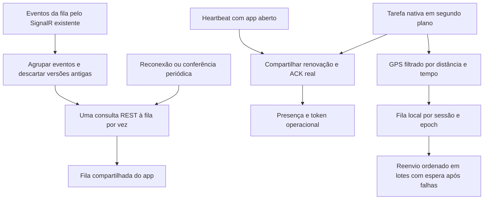

# Sincronização do turno — desempenho e recuperação

07/10/2026. Farley pediu corrigir os timeouts de heartbeat/fila/localização e otimizar o processo inteiro. A localização do emulador foi corrigida por ele; o escopo desta rodada é a sincronização. Implementação no mobile e otimização complementar do backend, reaproveitando o hub e endpoints existentes e acrescentando somente o contrato de GPS em lote. Farley autorizou commit/push somente do backend; mobile permanece local. Detalhes do servidor em `../motoboyBackEnd/docs/SINCRONIZACAO-DELIVERY.md` a partir da raiz do mobile. Admin sem alterações nesta rodada.

## O problema observado

O cliente cancelava as chamadas aos 10 segundos e imprimia três erros para cada timeout, incluindo headers com credenciais. Havia dois consumidores renovando a presença (provider e tarefa nativa) sem coordenação; nos logs foram observados heartbeats separados por poucos segundos. O heartbeat também buscava uma fila já consultada pelo radar a cada 15 s. Reenviar todas as posições pendentes compartilhava o mutex da presença e podia atrasar a renovação do turno.

A API respondeu novamente com sucesso em aproximadamente 1–2 s durante a investigação, incluindo uma consulta autenticada e somente de leitura à fila. Isso comprova recuperação naquele momento; não comprova a causa do atraso anterior. Não atribuir a causa ao Render, banco ou internet sem métricas do servidor.

## Funcionamento implementado



- `operationalRealtime.ts`: conecta ao `/hubs/delivery` existente, com JWT operacional. `DeliveryHub` já inscreve o cliente no grupo `delivery-session:{sessionId}`. `PedidoQueueRepository` emite `delivery.queue.updated` para esse grupo e `DeliveryOutboxPublisher` publica; não foi criado endpoint paralelo. Também observa os eventos de retorno. Token é relido e conferido por usuário/loja/sessão/epoch antes de conectar/reconectar. WebSocket com negociação dispensada; falha mantém o radar REST.
- `operationalQueueSync.ts`: agrupa eventos em 180 ms, confere loja/motoboy/versão, evita leituras paralelas e não perde uma versão recebida enquanto outra consulta termina. Ao conectar/reconectar, lê snapshot para cobrir eventos perdidos. Conectado e saudável: conferência a cada 60 s; sem canal: 15 s, ampliando para 30/60 s após falhas. Para no segundo plano, logout, mudança de contexto e desmontagem. Heartbeat/GPS em segundo plano continuam na tarefa nativa.
- `operationalRequests.ts`: leituras simultâneas da fila com o mesmo token compartilham a promessa; não há cache de pedidos concluídos. Heartbeats simultâneos compartilham a chamada e podem reutilizar o ACK dentro do intervalo do servidor, inclusive após rotação do token. O prazo conta do início da chamada real e não desliza ao reutilizar resposta. Restaurar força confirmação; resposta encerrada não entra no cache. Ações de pedido não entram nesse mecanismo.
- `mobileApi.ts`: só marca o último heartbeat após ACK real da API, conferindo sessão/epoch/token atuais. Foreground e headless usam essa confirmação. Não regride versão local. Espera das chamadas de sincronização limitada a 20 s, mantendo 10 s para os demais contratos.
- `operationalSessionStore.ts`: heartbeat saudável não busca fila novamente. Recuperação de conexão reconcilia a fila. Consulta lenta da fila não impede o heartbeat. Respostas antigas não substituem a fila/versão ou reabrem o turno durante logout.
- `trackingService.ts`: presença tem trabalho independente do GPS e um único heartbeat headless pendente. A tarefa nativa inicia ambos em paralelo, com validação de contexto e do servidor. GPS usa UUID/sequência por sessão, persistência antes do envio, filtros existentes (idle 50 m/60 s; rota 10 m/10 s), comparando também a última amostra pendente quando offline. Só escreve sequência quando uma nova posição precisa entrar na fila. Reenvia lotes ordenados de até 20 amostras por HTTP, sem iniciar outro lote após orçamento de 8 s; uma chamada em andamento continua limitada ao timeout de 20 s. Remove somente UUID/sequence confirmados individualmente; um histórico de 100 pontos pode usar cinco HTTP. API anterior recebe até cinco pontos individuais por execução, com fallback 404/405 armazenado por cinco minutos. Sensores -1 viram null e um contador local ausente usa session.nextLocationSequence do servidor. Falhas aguardam 15/30/60 s; callbacks podem continuar guardando posições sem insistir na rede. Limpeza após DELETE aguarda presença pendente e impede um ACK antigo de restaurar credenciais. Uma primeira posição obtida depois da troca de sessão não é enviada à nova sessão; iniciar o acompanhamento confirma o serviço sem prender a preparação à espera de GPS/HTTP.
- `apiService.ts`/`apiErrors.ts`: um registro seguro por erro, com limite de frequência de avisos de rede. Timeout e cancelamento são distintos; cancelamento solicitado não gera registro. Falha de rede e HTTP transitórios 408/429/502/503/504 usam aviso, não três `console.error` que abriam LogBox vermelho. Erros HTTP e sua mensagem específica continuam disponíveis ao chamador. Não imprime headers, request, corpo, token nem erro inteiro. Logs de sucesso detalhados exigem `EXPO_PUBLIC_API_DEBUG=true` em desenvolvimento. Removidos dumps de pedidos e a consulta automática à lista de motoboys usada como falso health check na abertura do app. Refresh principal continua compartilhado e agora também tem espera limitada; não é disparado por 401 operacional.
- `useFetchPedidos.ts`: usa a fila já confirmada no início/restauração; montar uma tela não repete essa leitura. Atualização manual continua disponível. Ações de aceite/coleta/entrega/pagamento não são repetidas automaticamente depois de timeout.

## Ganho esperado e limites

Em repouso e conectado, o radar periódico passa nominalmente de quatro consultas/minuto para uma (75% menos consultas **periódicas da fila**). A economia não inclui eventos, ações explícitas, reconexões, nem as antigas consultas adicionais do heartbeat que também foram removidas. Não é um benchmark de latência, consumo de bateria ou capacidade do servidor.

Permissões e heartbeat são mantidos: localização não renova o TTL da presença no backend (padrão 90 s). A fila GPS preserva a ordem exigida pelo servidor, que rejeita `STALE_SEQUENCE`; não enviar a posição mais nova antes do histórico pendente. Mantido o limite anterior de 100 amostras locais. Uma execução drena lotes dentro do orçamento; callbacks seguintes continuam o restante. Novo contrato autenticado: POST `/v2/motoboys/me/session/location/batch`, até 20 amostras/32 KiB, ACK accepted/duplicate/stale/rejected. Amostra inválida não bloqueia as seguintes; conflito de identidade mantém os pontos para diagnóstico. Só o último ponto novo de cada lote atualiza a posição/publica evento; ponto capturado há mais de 120 s não encerra retorno à loja. Migração do publicador: `20261007_01_outbox_publisher_lease.sql`. A conferência de 60 s recupera eventual evento não publicado ou perdido; não é garantia de push com app encerrado. O sistema operacional pode suspender o app; validar Android real/tela bloqueada/rede ruim.

Se os atrasos de 20 s persistirem, medir no servidor duração de request, espera por conexão PostgreSQL, bloqueios/transações e recursos da instância. Não aumentar TTL/timeout, criar cache de autorização ou duplicar endpoints sem essa evidência.

## Validação desta rodada

Restauração da identidade: a API tenta renovar o acesso principal uma vez. Falha de rede, timeout, 503 ou resposta inválida de refresh conserva as credenciais e permite retry; não usa o 401 original para classificar uma indisponibilidade como logout. Se a renovação não for possível ou a consulta continuar em 401, `AuthContext` remove apenas os três tokens principais e abre o login, preservando perfil, estabelecimento e dados operacionais/GPS. Não chama DELETE do turno. Login do mesmo usuário recupera sua seleção após validar os vínculos da API; trocar de usuário não reaproveita essa seleção. Refresh atrasado é cancelado se os tokens armazenados já mudaram. Restaurações simultâneas compartilham uma promessa e o contexto recebe o token renovado. Sete cenários de navegação passaram no roteiro `auth-revisar.cjs`; API totalmente interceptada e nenhum erro JS.

65 testes passaram em `docs/validacao-etapa2/lote3/sync-tests.cjs`, incluindo os 22 anteriores e os sete acrescentados na correção da restauração do acesso. Executam store, serviços, TaskManager/setup e adapter reais com rede/relógio/GPS controlados. O SDK SignalR instalado também conectou a um servidor WebSocket local com protocolo SignalR, recebeu evento e reconciliou após reconexão. Os testes não executam ações contra produção.

TypeScript, exportações Web e Android (Hermes) e revisão Web passaram: cinco grupos do lote 2.3 e seis grupos de cada lote 2.1/2.2, sem erros JavaScript. Os roteiros Web interceptam também WebSockets, para nenhum JWT fictício sair para a API real. O carregamento dos testes agora aguarda hidratação/fontes, sem depender do health check removido. Os mocks de vínculos foram atualizados para `/motoboys/me/vinculos`, mudança já presente no projeto durante esta rodada.

Verificação externa separada, somente de leitura: SDK conectou ao hub real existente em aproximadamente 1.350 ms, usando o contexto operacional existente e encerrando a conexão de diagnóstico. Isso valida disponibilidade/handshake/autenticação naquele instante; não comprova publicação de um novo pedido no aparelho. Foram enviados comandos de recarga de JavaScript ao emulador, sem logout nem limpeza de dados. Testar ainda pedido real, rede interrompida, app em segundo plano/tela bloqueada e recuperação em Android físico. Não houve aceite, entrega, alteração de pedido ou mensagem real nos testes.

```powershell
node --test docs/validacao-etapa2/lote3/sync-tests.cjs
npx tsc --noEmit
npx expo export --platform web --output-dir docs/validacao-etapa2/lote3/bundle
npx expo export --platform android --output-dir docs/validacao-etapa2/lote3/android-bundle
```

## Backend complementar

911 testes do backend passaram, incluindo 13 de integração com PostgreSQL local isolado. Backend distingue falha de banco de sessão inválida, usa o pool registrado na autenticação, reduz três comandos do heartbeat para um antes do evento, recebe GPS em lote, cancela consultas de fila/heartbeat/GPS com RequestAborted e publica eventos sem manter conexão aberta durante SignalR. Fila lê versão/dados no mesmo snapshot. Métricas nativas por operação/status, espera do pool, outcomes GPS e idade/falhas da outbox; requests acima de 2 s geram log seguro. Integração mobile: 58 testes, TypeScript e exportação Android/Hermes passaram. Revisão Web de 17 grupos é evidência da rodada anterior, sem alterações visuais nesta. Desempenho em produção, conclusão da migração/deploy e background em aparelho ainda precisam de validação.
